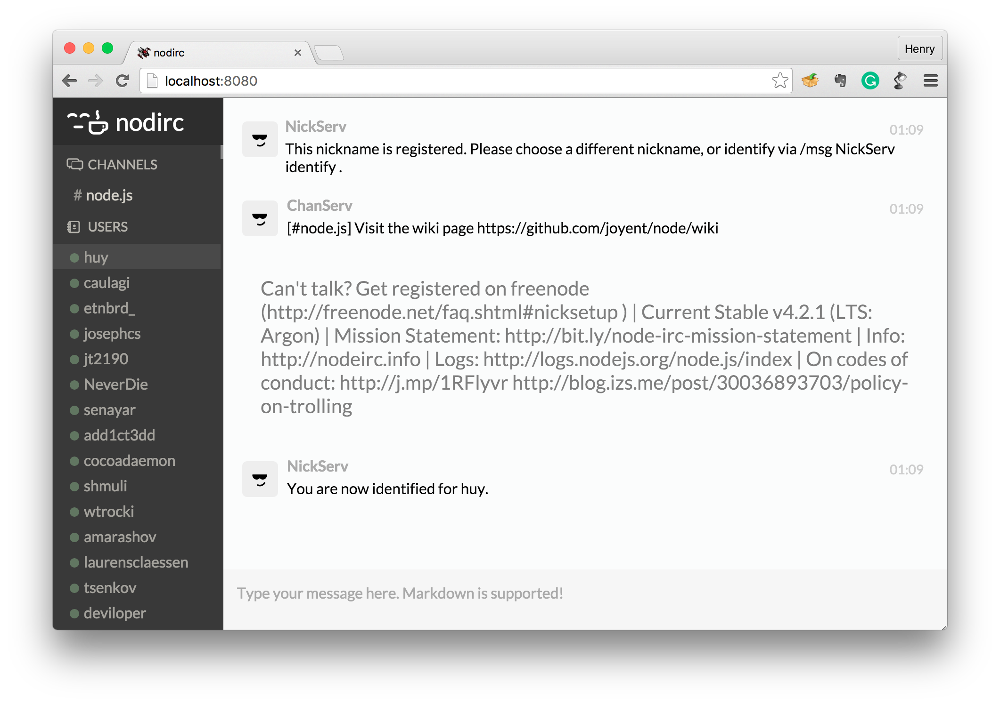

# nodirc - Make IRC fun again

`nodirc` is a simple IRC client with flat design and Markdown support. That's what make it become an IRC client for Developers!



## How to use
1. Clone this repository
2. Install the dependencies with:

  ```bash
  npm install
  ```
3. Run the server with:

  ```bash
  npm start
  ```
4. Go to [http://localhost:8080](http://localhost:8080) to use

## TODO
- Add Markdown support
- Add URL parser
- Handle more error
- Send raw command in chat box
- Fix chat box input layout issue
- Handle system messages (users login/logout)
- Join multiple channel
- Send private messages to users
- Multiline chat input box support
